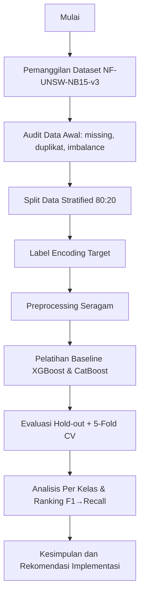
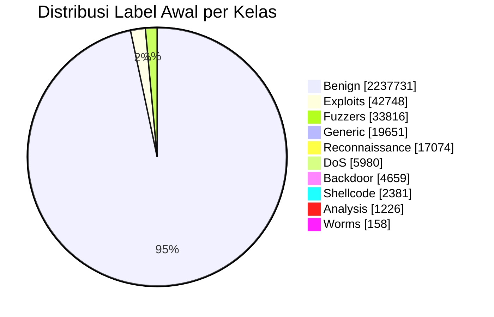
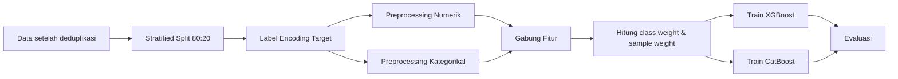

# Analisis Komparatif XGBoost dan CatBoost untuk Sistem Deteksi Intrusi pada Dataset NF-UNSW-NB15-v3

**Nama Penulis 1**1, **Nama Penulis 2**2  
1Program Studi ..., Fakultas ..., Universitas ...  
2Program Studi ..., Fakultas ..., Universitas ...  
Email: penulis@domain.ac.id

## ABSTRAK

Penelitian ini menyajikan komparasi menyeluruh dua algoritma *gradient boosting* (XGBoost dan CatBoost) untuk tugas *Intrusion Detection System* (IDS) multikelas pada dataset NF-UNSW-NB15-v3 yang sangat tidak seimbang. Protokol eksperimen dibuat reproduksibel pada Kaggle Notebook (Python 3.12.12, seed 42), dengan deteksi akselerasi GPU per model dan *fallback* CPU otomatis. Pemanggilan data dilakukan melalui auto-discovery `/kaggle/input` dan jalur lokal, sedangkan preprocessing diseragamkan melalui imputasi median untuk fitur numerik, penanganan kategori *native* (`MISSING/UNKNOWN`), dan *balanced class weighting*. Evaluasi meliputi metrik hold-out (Accuracy, Balanced Accuracy, Precision, Recall, F1, MCC, ROC-AUC), efisiensi komputasi (waktu pelatihan, total inferensi, latensi inferensi/sampel), validasi 5-fold *Stratified Cross-Validation* (weighted F1), serta analisis detail per kelas menggunakan *classification report* penuh dan confusion matrix. Hasil menunjukkan XGBoost menjadi model terbaik berdasarkan prioritas ranking F1→Recall dengan Accuracy 0,9901; Balanced Accuracy 0,8547; Precision 0,9915; Recall 0,9901; F1 0,9903; MCC 0,9061; ROC-AUC 0,9999; CV F1 0,9901±0,0001. CatBoost memiliki kualitas prediksi sedikit lebih rendah (F1 0,9865), tetapi lebih efisien (pelatihan 34,386 detik vs 54,995 detik; inferensi 0,0017 ms/sampel vs 0,0042 ms/sampel). Pada level per kelas, XGBoost lebih konsisten di kelas minoritas pada sebagian besar metrik, sedangkan CatBoost kompetitif untuk skenario yang menuntut latensi sangat rendah.

**Kata kunci**: deteksi intrusi, XGBoost, CatBoost, NF-UNSW-NB15-v3, klasifikasi multikelas

## ABSTRACT

This study provides a comprehensive comparison of two gradient boosting algorithms (XGBoost and CatBoost) for multiclass Intrusion Detection System (IDS) modeling on the highly imbalanced NF-UNSW-NB15-v3 dataset. A reproducible protocol is implemented in Kaggle Notebook (Python 3.12.12, seed 42), including per-model GPU detection with automatic CPU fallback. Data loading uses auto-discovery from `/kaggle/input` and local paths, while preprocessing is standardized with median imputation for numeric features, native categorical handling (`MISSING/UNKNOWN`), and balanced class weighting. Evaluation covers hold-out metrics (Accuracy, Balanced Accuracy, Precision, Recall, F1, MCC, ROC-AUC), computational efficiency (training time, total inference time, inference latency per sample), 5-fold stratified weighted-F1 cross-validation, and class-level analysis through full classification reports and confusion matrices. Results show XGBoost as the top-ranked model by F1→Recall priority with Accuracy 0.9901, Balanced Accuracy 0.8547, Precision 0.9915, Recall 0.9901, F1 0.9903, MCC 0.9061, ROC-AUC 0.9999, and CV F1 0.9901±0.0001. CatBoost yields slightly lower detection quality (F1 0.9865) but better computational efficiency (34.386 s vs 54.995 s training; 0.0017 ms/sample vs 0.0042 ms/sample inference). At the class level, XGBoost is generally more consistent on minority classes, while CatBoost remains practical for low-latency deployment needs.

**Keywords**: intrusion detection, XGBoost, CatBoost, NF-UNSW-NB15-v3, multiclass classification

## 1. PENDAHULUAN

Pertumbuhan lalu lintas jaringan dan kompleksitas pola serangan menuntut IDS yang tidak hanya akurat secara global, tetapi juga stabil pada kelas serangan minoritas (Ring et al., 2019). Model *gradient boosting* seperti XGBoost dan CatBoost relevan karena mampu menangani hubungan nonlinier, heterogenitas fitur, dan skenario data besar (Chen & Guestrin, 2016; Prokhorenkova et al., 2018).

Dataset NF-UNSW-NB15-v3 dipilih karena merepresentasikan distribusi serangan yang sangat tidak seimbang pada konteks lalu lintas jaringan realistis (Moustafa & Slay, 2015; Sarhan et al., 2021). Pada kondisi ini, penggunaan metrik tunggal seperti accuracy berisiko menutupi performa buruk pada kelas minoritas, sehingga metrik seperti Balanced Accuracy, F1, Recall, dan MCC menjadi penting (He & Garcia, 2009; Chicco & Jurman, 2020).

Penelitian ini berkontribusi pada: (1) pelaporan lengkap hasil komparasi baseline XGBoost vs CatBoost dari sisi kualitas prediksi dan efisiensi komputasi, (2) pelaporan granular per kelas (precision, recall, F1, support), dan (3) formulasi keputusan pemilihan model berdasarkan prioritas F1→Recall yang relevan untuk kebutuhan IDS.

## 2. METODE PENELITIAN

Metode penelitian disusun dalam alur terstruktur agar replikasi eksperimen lebih mudah, sekaligus menjaga komparasi XGBoost dan CatBoost tetap adil pada data yang sangat tidak seimbang.

### 2.1 Desain Penelitian dan Lingkungan Eksperimen

Eksperimen dijalankan pada Kaggle Notebook (Linux 6.6.113+, Python 3.12.12) dengan seed 42. Notebook mendeteksi GPU per model (`detect_xgboost_gpu`, `detect_catboost_gpu`) dan melakukan *fallback* otomatis ke CPU bila GPU tidak tersedia.

**Tabel 1. Ringkasan lingkungan eksperimen**

| Komponen | Nilai |
|---|---|
| Environment | Kaggle Notebook |
| Sistem Operasi | Linux 6.6.113+ |
| Python | 3.12.12 |
| Seed | 42 |
| XGBoost GPU | AKTIF |
| CatBoost GPU | AKTIF |
| pandas | 2.3.3 |
| numpy | 2.0.2 |
| scikit-learn | 1.6.1 |
| xgboost | 3.2.0 |
| catboost | 1.2.10 |

Tabel 1 memastikan seluruh komponen eksperimen terdokumentasi, sehingga hasil dapat diulang pada konfigurasi perangkat lunak yang setara.

**Gambar 1. Alur penelitian komparatif XGBoost dan CatBoost pada IDS multikelas.**

Gambar 1 merangkum alur ujung-ke-ujung penelitian, sehingga urutan tahapan dari data mentah sampai keputusan model dapat dibaca secara cepat.

### 2.2 Pemanggilan Dataset dan Audit Awal

Dataset dicari otomatis di `/kaggle/input`, lalu *fallback* ke jalur lokal (`./`, `./data`, `./dataset`) agar pipeline tetap portabel lintas lingkungan. Dataset awal berukuran 2.365.424 baris × 55 kolom.

**Tabel 2. Ringkasan audit dataset awal**

| Metrik | Nilai |
|---|---:|
| Jumlah baris | 2.365.424 |
| Jumlah kolom | 55 |
| Duplikat awal | 14.815 |
| Nilai hilang total | 63.425 |
| Jumlah kelas | 10 |
| Imbalance ratio (Benign/Worms) | 14.162,85x |

Tabel 2 menunjukkan skala data besar dan ketidakseimbangan ekstrem, sehingga metrik evaluasi tidak cukup hanya mengandalkan accuracy.

**Tabel 3. Komposisi tipe data**

| Tipe data | Jumlah kolom |
|---|---:|
| int64 | 49 |
| object | 3 |
| float64 | 3 |

Tabel 3 menegaskan dominasi fitur numerik, yang mendasari strategi imputasi median pada mayoritas variabel.

**Tabel 4. Distribusi label sebelum split**

| Kelas | Jumlah | Proporsi (%) |
|---|---:|---:|
| Benign | 2.237.731 | 94,60 |
| Exploits | 42.748 | 1,81 |
| Fuzzers | 33.816 | 1,43 |
| Generic | 19.651 | 0,83 |
| Reconnaissance | 17.074 | 0,72 |
| DoS | 5.980 | 0,25 |
| Backdoor | 4.659 | 0,20 |
| Shellcode | 2.381 | 0,10 |
| Analysis | 1.226 | 0,05 |
| Worms | 158 | 0,01 |

Tabel 4 memperlihatkan dominasi kelas *Benign* dibanding kelas minoritas seperti *Worms* dan *Analysis*.

**Gambar 2. Ringkasan visual ketimpangan kelas sebelum pembagian data.**

Gambar 2 menekankan bahwa mayoritas sampel berada di kelas *Benign*, sehingga strategi penanganan *imbalance* menjadi bagian inti metode.

### 2.3 Split Data, Preprocessing, dan Penanganan Imbalance

Setelah penghapusan duplikasi, data dibagi menggunakan *stratified train-test split* (80:20). Label dikodekan dengan `LabelEncoder` untuk skenario multikelas 10 kelas.

**Tabel 5. Ringkasan skenario dan split data**

| Komponen | Nilai |
|---|---|
| Sampel setelah *drop duplicates* | 2.350.609 |
| Jumlah fitur untuk model | 54 |
| Jumlah kelas | 10 |
| Proporsi train:test | 80% : 20% |
| Ukuran train | 1.880.487 × 54 |
| Ukuran test | 470.122 × 54 |

Tabel 5 menunjukkan data latih dan data uji cukup besar untuk pelatihan model dan evaluasi hold-out yang stabil.

**Tabel 6. Validasi proporsi kelas train vs test**

| Kelas | Train (%) | Test (%) |
|---|---:|---:|
| Analysis | 0,05 | 0,05 |
| Backdoor | 0,20 | 0,20 |
| Benign | 94,57 | 94,57 |
| DoS | 0,25 | 0,25 |
| Exploits | 1,82 | 1,82 |
| Fuzzers | 1,44 | 1,44 |
| Generic | 0,84 | 0,84 |
| Reconnaissance | 0,73 | 0,73 |
| Shellcode | 0,10 | 0,10 |
| Worms | 0,01 | 0,01 |

Tabel 6 mengonfirmasi bahwa proporsi kelas di train dan test tetap konsisten karena penggunaan *stratified split*.

Tahapan persiapan data dibuat identik pada kedua model dengan urutan berikut (He & Garcia, 2009; Pedregosa et al., 2011):
1. Pemisahan fitur numerik dan kategorikal
2. Label encoding pada target multikelas
3. Konversi `inf/-inf` menjadi `NaN`
4. Imputasi median untuk fitur numerik
5. Imputasi `MISSING` dan pemetaan `UNKNOWN` untuk fitur kategorikal
6. Pembobotan kelas seimbang ke dalam `sample_weight`

**Tabel 7. Ringkasan preprocessing**

| Komponen | Nilai |
|---|---|
| Jumlah fitur awal | 54 |
| Jumlah fitur kategorikal | 2 |
| Jumlah fitur numerik | 52 |
| Strategi imputasi numerik | Median |
| Strategi imputasi kategorikal | MISSING / UNKNOWN |

Tabel 7 menegaskan konsistensi praproses antar model agar perbandingan hasil tetap adil.

**Tabel 8. Class weight (encoded class)**

| Encoded Class | Label | Class Weight |
|---:|---|---:|
| 0 | Analysis | 191,6908 |
| 1 | Backdoor | 50,4693 |
| 2 | Benign | 0,1057 |
| 3 | DoS | 39,3654 |
| 4 | Exploits | 5,4993 |
| 5 | Fuzzers | 6,9511 |
| 6 | Generic | 11,9616 |
| 7 | Reconnaissance | 13,7674 |
| 8 | Shellcode | 98,7132 |
| 9 | Worms | 1492,4500 |

Tabel 8 memperlihatkan bobot jauh lebih tinggi pada kelas minoritas untuk mengurangi bias model terhadap kelas mayoritas.

**Gambar 3. Diagram pipeline preprocessing dan pelatihan model.**

Gambar 3 memperjelas bahwa kedua model menerima perlakuan data yang sama sebelum tahap evaluasi.

### 2.4 Konfigurasi Baseline Model

**Tabel 9. Konfigurasi baseline aktual pada notebook**

| Komponen | XGBoost | CatBoost |
|---|---|---|
| Estimator | XGBClassifier | CatBoostClassifier |
| n_estimators/iterations | 300 | 300 |
| learning_rate | 0,1 | 0,1 |
| depth/max_depth | 6 | 6 |
| subsample | 0,9 | - |
| colsample_bytree | 0,9 | - |
| objective/loss | `multi:softprob` | `MultiClass` |
| eval_metric | `mlogloss` | default internal |
| Penanganan fitur kategorikal | `enable_categorical=True` | `cat_features` saat fit |
| Device | `cuda` | `GPU` |

Tabel 9 menunjukkan konfigurasi baseline yang setara agar perbedaan performa mencerminkan karakter model, bukan perbedaan setup.

### 2.5 Protokol Evaluasi dan Kriteria Keputusan

Evaluasi dilakukan pada data uji (hold-out) menggunakan Accuracy, Balanced Accuracy, Precision, Recall, F1, MCC, ROC-AUC, waktu pelatihan, waktu inferensi total, dan latensi inferensi per sampel. Validasi tambahan dilakukan dengan 5-fold *Stratified Cross-Validation* (weighted F1). Pemilihan model akhir mengikuti prioritas **F1 lalu Recall** (Sokolova & Lapalme, 2009; Chicco & Jurman, 2020).

## 3. HASIL DAN PEMBAHASAN

### 3.1 Hasil Kuantitatif Utama (Hold-out + CV)

**Tabel 10. Komparasi utama model (diurutkan F1→Recall)**

| Rank | Model | Accuracy | Balanced Accuracy | Precision | Recall | F1 | MCC | ROC-AUC | CV F1 (mean±std) | Train Time (s) | Infer Total (s) | Infer/Sample (ms) |
|---:|---|---:|---:|---:|---:|---:|---:|---:|---:|---:|---:|---:|
| 1 | XGBoost | 0,9901 | 0,8547 | 0,9915 | 0,9901 | 0,9903 | 0,9061 | 0,9999 | 0,9901 ± 0,0001 | 54,995 | 1,9896 | 0,0042 |
| 2 | CatBoost | 0,9861 | 0,8361 | 0,9894 | 0,9861 | 0,9865 | 0,8677 | 0,9999 | 0,9863 ± 0,0001 | 34,386 | 0,7874 | 0,0017 |

XGBoost unggul pada seluruh metrik kualitas deteksi inti, sedangkan CatBoost unggul pada efisiensi komputasi. Selisih utama XGBoost terhadap CatBoost adalah +0,0038 (F1), +0,0040 (Recall), +0,0186 (Balanced Accuracy), dan +0,0384 (MCC). Standar deviasi CV F1 keduanya sama-sama rendah (0,0001), menandakan stabilitas lintas fold.

**Gambar 4. Bar chart metrik utama antar model (Cell 21).**  
Bar chart horizontal membandingkan Accuracy, Balanced Accuracy, Precision, Recall, F1, dan ROC-AUC untuk XGBoost dan CatBoost (sumbu-x: skor 0–1; sumbu-y: metrik). Visual ini menegaskan keunggulan konsisten XGBoost pada metrik kualitas deteksi utama.

**Gambar 5. Heatmap komparasi metrik agregat model (Cell 25).**  
Heatmap menampilkan metrik agregat (Accuracy, Balanced Accuracy, Precision, Recall, F1, MCC, ROC-AUC, CV F1 mean) per model, dengan intensitas warna merepresentasikan besar skor (semakin gelap semakin tinggi). Visual ini mempermudah pembacaan posisi relatif kedua model pada banyak metrik sekaligus.

### 3.2 Pemenang per Aspek Evaluasi dan Trade-off Operasional

**Tabel 11. Pemenang per aspek**

| Aspek | Model pemenang |
|---|---|
| Accuracy tertinggi | XGBoost |
| Balanced Accuracy tertinggi | XGBoost |
| MCC tertinggi | XGBoost |
| Training tercepat | CatBoost |
| Inferensi tercepat | CatBoost |
| Peringkat akhir (F1→Recall) | XGBoost |

CatBoost ~37,47% lebih cepat saat training dan ~59,52% lebih cepat pada latensi inferensi per sampel. Namun, untuk konteks IDS yang menekankan minimisasi *missed attack* pada kelas minoritas, keunggulan XGBoost pada Balanced Accuracy dan MCC memberi justifikasi pemilihan model utama.

**Gambar 6. Grafik waktu training dan inferensi (Cell 23).**  
Visual terdiri dari dua panel: waktu pelatihan (detik) dan latensi inferensi per sampel (milidetik), dengan sumbu-x sebagai nilai waktu dan sumbu-y sebagai model. Grafik ini memperjelas sisi efisiensi operasional kedua model.

### 3.3 Laporan Klasifikasi Lengkap per Model

#### 3.3.1 Classification Report – XGBoost

**Tabel 12. Metrik per kelas XGBoost**

| Kelas | Precision | Recall | F1-Score | Support |
|---|---:|---:|---:|---:|
| Analysis | 0,4278 | 0,9184 | 0,5837 | 245 |
| Backdoor | 0,9368 | 0,9388 | 0,9378 | 932 |
| Benign | 1,0000 | 1,0000 | 1,0000 | 444.586 |
| DoS | 0,4582 | 0,7027 | 0,5547 | 1.194 |
| Exploits | 0,9223 | 0,7000 | 0,7959 | 8.549 |
| Fuzzers | 0,7963 | 0,9145 | 0,8513 | 6.763 |
| Generic | 0,9485 | 0,9046 | 0,9260 | 3.930 |
| Reconnaissance | 0,7972 | 0,8079 | 0,8025 | 3.415 |
| Shellcode | 0,5981 | 0,9412 | 0,7314 | 476 |
| Worms | 0,7188 | 0,7188 | 0,7188 | 32 |
| macro avg | 0,7604 | 0,8547 | 0,7902 | 470.122 |
| weighted avg | 0,9915 | 0,9901 | 0,9903 | 470.122 |

Tabel 12 menunjukkan XGBoost relatif stabil pada mayoritas kelas dan tetap kompetitif pada kelas minoritas, dengan *weighted average* yang sangat tinggi.

#### 3.3.2 Classification Report – CatBoost

**Tabel 13. Metrik per kelas CatBoost**

| Kelas | Precision | Recall | F1-Score | Support |
|---|---:|---:|---:|---:|
| Analysis | 0,2963 | 0,9918 | 0,4563 | 245 |
| Backdoor | 0,6449 | 0,9217 | 0,7588 | 932 |
| Benign | 1,0000 | 1,0000 | 1,0000 | 444.586 |
| DoS | 0,3429 | 0,5988 | 0,4361 | 1.194 |
| Exploits | 0,9242 | 0,5707 | 0,7057 | 8.549 |
| Fuzzers | 0,7363 | 0,8858 | 0,8042 | 6.763 |
| Generic | 0,9346 | 0,8514 | 0,8911 | 3.930 |
| Reconnaissance | 0,7868 | 0,7286 | 0,7566 | 3.415 |
| Shellcode | 0,4411 | 0,9370 | 0,5999 | 476 |
| Worms | 0,1972 | 0,8750 | 0,3218 | 32 |
| macro avg | 0,6304 | 0,8361 | 0,6730 | 470.122 |
| weighted avg | 0,9894 | 0,9861 | 0,9865 | 470.122 |

Tabel 13 menunjukkan CatBoost memiliki beberapa kelas dengan *recall* tinggi, tetapi terjadi kompromi pada *precision* di sejumlah kelas minoritas sehingga F1 agregat lebih rendah.

**Gambar 7. Heatmap F1 per kelas antar model (Cell 19).**  
Heatmap menyajikan F1 tiap kelas pada kolom model (XGBoost/CatBoost) dan baris kelas serangan/benign, dengan kode warna untuk besar skor. Visual ini memperlihatkan perbedaan performa antar model per kelas, terutama kelas minoritas.

**Gambar 8. Confusion matrix mentah dan ternormalisasi per model (Cell 22).**  
Setiap model ditampilkan dalam dua matriks: confusion matrix mentah (jumlah absolut) dan confusion matrix ternormalisasi per kelas aktual (*normalize=true*). Kombinasi ini membantu membaca pola salah-klasifikasi baik dari sisi volume kesalahan maupun proporsi kesalahan antar kelas.

### 3.4 Analisis Selisih Metrik Per Kelas (XGBoost – CatBoost)

**Tabel 14. Delta per kelas untuk precision, recall, dan F1**

| Kelas | Support | ΔPrecision | ΔRecall | ΔF1 |
|---|---:|---:|---:|---:|
| Analysis | 245 | +0,1315 | -0,0734 | +0,1274 |
| Backdoor | 932 | +0,2919 | +0,0171 | +0,1790 |
| Benign | 444.586 | +0,0000 | +0,0000 | +0,0000 |
| DoS | 1.194 | +0,1153 | +0,1039 | +0,1186 |
| Exploits | 8.549 | -0,0019 | +0,1293 | +0,0902 |
| Fuzzers | 6.763 | +0,0600 | +0,0287 | +0,0471 |
| Generic | 3.930 | +0,0139 | +0,0532 | +0,0349 |
| Reconnaissance | 3.415 | +0,0104 | +0,0793 | +0,0459 |
| Shellcode | 476 | +0,1570 | +0,0042 | +0,1315 |
| Worms | 32 | +0,5216 | -0,1562 | +0,3970 |

Interpretasi utama: XGBoost lebih konsisten meningkatkan F1 pada hampir semua kelas serangan, terutama kelas minoritas (*Worms*, *Backdoor*, *Shellcode*, *Analysis*). CatBoost menunjukkan recall sangat tinggi pada beberapa kelas langka (mis. *Analysis* dan *Worms*), tetapi dengan penalti precision yang besar sehingga F1 total tetap lebih rendah.

### 3.5 Implikasi Implementasi IDS

Hasil menunjukkan strategi pemilihan model harus mengikuti prioritas sistem:
- **Prioritas kualitas deteksi** (khususnya kelas minoritas dan kestabilan lintas kelas): pilih **XGBoost**.
- **Prioritas latensi dan efisiensi komputasi** (deployment real-time terbatas sumber daya): **CatBoost** adalah alternatif kuat.

Dengan demikian, penggunaan metrik gabungan (F1, Recall, Balanced Accuracy, MCC) bersama metrik operasional (waktu training/inferensi) memberikan dasar keputusan yang lebih tepat daripada accuracy tunggal (Sokolova & Lapalme, 2009; Chicco & Jurman, 2020).

## 4. KETERBATASAN PENELITIAN

Keterbatasan utama studi ini:
1. Konfigurasi model masih baseline dan belum melalui *hyperparameter tuning* ekstensif.
2. Evaluasi hanya pada satu dataset (NF-UNSW-NB15-v3), sehingga generalisasi lintas dataset perlu diuji lebih lanjut.
3. Analisis operasional belum memasukkan metrik konsumsi memori/energi dan throughput produksi.
4. Hasil tetap sensitif terhadap kualitas data dan distribusi kelas pada skenario aktual.

## 5. KESIMPULAN DAN SARAN

Berdasarkan komparasi menyeluruh dari seluruh keluaran notebook, **XGBoost** menjadi model terbaik dengan prioritas ranking F1→Recall pada eksperimen ini. Model ini memberikan keseimbangan terbaik antara akurasi global dan kestabilan antar kelas (Balanced Accuracy, MCC), serta konsisten pada validasi silang.

**CatBoost** tetap sangat relevan pada kebutuhan inferensi cepat karena unggul signifikan pada waktu training dan latensi inferensi. Oleh karena itu, rekomendasi implementasi adalah:
- gunakan XGBoost untuk sistem IDS yang menekankan kualitas deteksi maksimum,
- gunakan CatBoost untuk lingkungan operasional yang menuntut respons sangat cepat.

Penelitian lanjutan disarankan mencakup optimasi hiperparameter terstruktur, validasi lintas dataset IDS, serta evaluasi metrik operasional lanjutan (memori, throughput, energi).

## UCAPAN TERIMA KASIH

Penulis mengucapkan terima kasih kepada penyedia dataset NF-UNSW-NB15-v3 dan platform Kaggle Notebook yang mendukung pelaksanaan eksperimen.

## DAFTAR PUSTAKA

Chen, T., & Guestrin, C. (2016). XGBoost: A scalable tree boosting system. In *Proceedings of the 22nd ACM SIGKDD International Conference on Knowledge Discovery and Data Mining* (pp. 785–794). https://doi.org/10.1145/2939672.2939785

Chicco, D., & Jurman, G. (2020). The advantages of the Matthews correlation coefficient (MCC) over F1 score and accuracy in binary classification evaluation. *BMC Genomics, 21*(1), 6. https://doi.org/10.1186/s12864-019-6413-7

He, H., & Garcia, E. A. (2009). Learning from imbalanced data. *IEEE Transactions on Knowledge and Data Engineering, 21*(9), 1263–1284. https://doi.org/10.1109/TKDE.2008.239

Moustafa, N., & Slay, J. (2015). UNSW-NB15: A comprehensive data set for network intrusion detection systems (UNSW-NB15 network data set). In *2015 Military Communications and Information Systems Conference (MilCIS)* (pp. 1–6). IEEE. https://doi.org/10.1109/MilCIS.2015.7348942

Pedregosa, F., Varoquaux, G., Gramfort, A., Michel, V., Thirion, B., Grisel, O., . . . Duchesnay, E. (2011). Scikit-learn: Machine learning in Python. *Journal of Machine Learning Research, 12*, 2825–2830.

Prokhorenkova, L., Gusev, G., Vorobev, A., Dorogush, A. V., & Gulin, A. (2018). CatBoost: Unbiased boosting with categorical features. In S. Bengio, H. Wallach, H. Larochelle, K. Grauman, N. Cesa-Bianchi, & R. Garnett (Eds.), *Advances in Neural Information Processing Systems* (Vol. 31, pp. 6638–6648). Red Hook, NY: Curran Associates, Inc.

Ring, M., Wunderlich, S., Scheuring, D., Landes, D., & Hotho, A. (2019). A survey of network-based intrusion detection data sets. *Computers & Security, 86*, 147–167. https://doi.org/10.1016/j.cose.2019.06.005

Sarhan, M., Layeghy, S., Moustafa, N., Portmann, M., & Debie, E. (2021). NetFlow datasets for machine learning-based network intrusion detection systems. *IEEE Access, 9*, 78530–78550. https://doi.org/10.1109/ACCESS.2021.3085096

Sokolova, M., & Lapalme, G. (2009). A systematic analysis of performance measures for classification tasks. *Information Processing & Management, 45*(4), 427–437. https://doi.org/10.1016/j.ipm.2009.03.002

---

**Catatan finalisasi sebelum submit jurnal:**  
Sebelum submit, lengkapi identitas penulis, afiliasi, dan email korespondensi, samakan gaya sitasi serta format tabel/gambar sesuai template jurnal tujuan (Sinta 4), dan pastikan seluruh tabel/gambar telah memiliki nomor serta caption final saat layout dokumen akhir.
