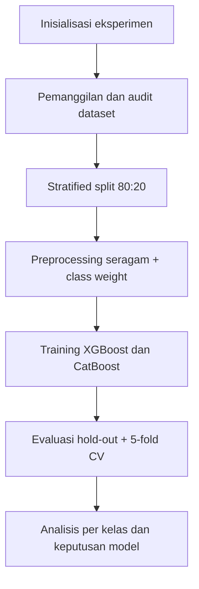

# Analisis Komparatif XGBoost dan CatBoost untuk Sistem Deteksi Intrusi pada Dataset NF-UNSW-NB15-v3

**Nama Penulis 1**1, **Nama Penulis 2**2  
1Program Studi ..., Fakultas ..., Universitas ...  
2Program Studi ..., Fakultas ..., Universitas ...  
Email: penulis@domain.ac.id

## ABSTRAK

Penelitian ini menyajikan komparasi menyeluruh dua algoritma *gradient boosting* (XGBoost dan CatBoost) untuk tugas *Intrusion Detection System* (IDS) multikelas pada dataset NF-UNSW-NB15-v3 yang sangat tidak seimbang. Protokol eksperimen dibuat reproduksibel pada Kaggle Notebook (Python 3.12.12, seed 42), dengan deteksi akselerasi GPU per model dan *fallback* CPU otomatis. Pemanggilan data dilakukan melalui auto-discovery `/kaggle/input` dan jalur lokal, sedangkan preprocessing diseragamkan melalui imputasi median untuk fitur numerik, penanganan kategori *native* (`MISSING/UNKNOWN`), dan *balanced class weighting*. Evaluasi meliputi metrik hold-out (Accuracy, Balanced Accuracy, Precision, Recall, F1, MCC, ROC-AUC), efisiensi komputasi (waktu pelatihan, total inferensi, latensi inferensi/sampel), validasi 5-fold *Stratified Cross-Validation* (weighted F1), serta analisis detail per kelas menggunakan *classification report* penuh dan confusion matrix. Hasil menunjukkan XGBoost menjadi model terbaik berdasarkan prioritas ranking F1→Recall dengan Accuracy 0,9901; Balanced Accuracy 0,8547; Precision 0,9915; Recall 0,9901; F1 0,9903; MCC 0,9061; ROC-AUC 0,9999; CV F1 0,9901±0,0001. CatBoost memiliki kualitas prediksi sedikit lebih rendah (F1 0,9865), tetapi lebih efisien (pelatihan 34,386 detik vs 54,995 detik; inferensi 0,0017 ms/sampel vs 0,0042 ms/sampel). Pada level per kelas, XGBoost lebih konsisten di kelas minoritas pada sebagian besar metrik, sedangkan CatBoost kompetitif untuk skenario yang menuntut latensi sangat rendah.

**Kata kunci**: deteksi intrusi, XGBoost, CatBoost, NF-UNSW-NB15-v3, klasifikasi multikelas

## ABSTRACT

This study provides a comprehensive comparison of two gradient boosting algorithms (XGBoost and CatBoost) for multiclass Intrusion Detection System (IDS) modeling on the highly imbalanced NF-UNSW-NB15-v3 dataset. A reproducible protocol is implemented in Kaggle Notebook (Python 3.12.12, seed 42), including per-model GPU detection with automatic CPU fallback. Data loading uses auto-discovery from `/kaggle/input` and local paths, while preprocessing is standardized with median imputation for numeric features, native categorical handling (`MISSING/UNKNOWN`), and balanced class weighting. Evaluation covers hold-out metrics (Accuracy, Balanced Accuracy, Precision, Recall, F1, MCC, ROC-AUC), computational efficiency (training time, total inference time, inference latency per sample), 5-fold stratified weighted-F1 cross-validation, and class-level analysis through full classification reports and confusion matrices. Results show XGBoost as the top-ranked model by F1→Recall priority with Accuracy 0.9901, Balanced Accuracy 0.8547, Precision 0.9915, Recall 0.9901, F1 0.9903, MCC 0.9061, ROC-AUC 0.9999, and CV F1 0.9901±0.0001. CatBoost yields slightly lower detection quality (F1 0.9865) but better computational efficiency (34.386 s vs 54.995 s training; 0.0017 ms/sample vs 0.0042 ms/sample inference). At the class level, XGBoost is generally more consistent on minority classes, while CatBoost remains practical for low-latency deployment needs.

**Keywords**: intrusion detection, XGBoost, CatBoost, NF-UNSW-NB15-v3, multiclass classification

## 1. PENDAHULUAN

Pertumbuhan lalu lintas jaringan dan kompleksitas pola serangan menuntut IDS yang tidak hanya akurat secara global, tetapi juga stabil pada kelas serangan minoritas (Ring et al., 2019). Model *gradient boosting* seperti XGBoost dan CatBoost relevan karena mampu menangani hubungan nonlinier, heterogenitas fitur, dan skenario data besar (Chen & Guestrin, 2016; Prokhorenkova et al., 2018).

Dataset NF-UNSW-NB15-v3 dipilih karena merepresentasikan distribusi serangan yang sangat tidak seimbang pada konteks lalu lintas jaringan realistis (Moustafa & Slay, 2015; Sarhan et al., 2021). Pada kondisi ini, penggunaan metrik tunggal seperti accuracy berisiko menutupi performa buruk pada kelas minoritas, sehingga metrik seperti Balanced Accuracy, F1, Recall, dan MCC menjadi penting (He & Garcia, 2009; Chicco & Jurman, 2020).

Penelitian ini berkontribusi pada: (1) pelaporan lengkap hasil komparasi baseline XGBoost vs CatBoost dari sisi kualitas prediksi dan efisiensi komputasi, (2) pelaporan granular per kelas (precision, recall, F1, support), dan (3) formulasi keputusan pemilihan model berdasarkan prioritas F1→Recall yang relevan untuk kebutuhan IDS.

## 2. METODE PENELITIAN

Metode penelitian disederhanakan menjadi alur tunggal: penyiapan lingkungan, audit data, split dan preprocessing seragam, pelatihan dua model baseline, lalu evaluasi kualitas dan efisiensi.

**Gambar 1. Alur ringkas penelitian komparatif XGBoost dan CatBoost.**

Gambar 1 memperlihatkan urutan proses inti secara end-to-end agar alur eksperimen mudah direplikasi.

### 2.1 Ringkasan Setup dan Data

**Tabel 1. Ringkasan setup eksperimen dan karakter data**

| Komponen | Nilai Ringkas |
|---|---|
| Environment | Kaggle Notebook (Python 3.12.12, seed 42) |
| Device | GPU aktif untuk XGBoost dan CatBoost (fallback CPU otomatis) |
| Dataset | NF-UNSW-NB15-v3 |
| Ukuran awal data | 2.365.424 baris × 55 kolom |
| Kelas | 10 kelas, sangat tidak seimbang |
| Imbalance ratio (Benign/Worms) | 14.162,85x |

Tabel 1 menegaskan konteks eksperimen: skala data besar dan ketidakseimbangan kelas ekstrem.

### 2.2 Split, Preprocessing, dan Model

Data dideduplikasi, lalu dibagi dengan *stratified split* 80:20. Target diencode dengan `LabelEncoder` pada train-test, sedangkan preprocessing fitur dibuat identik untuk kedua model: penanganan `inf/-inf`, imputasi median numerik, imputasi `MISSING/UNKNOWN` kategorikal, dan pembobotan kelas melalui `sample_weight`.

**Tabel 2. Ringkasan pipeline data dan konfigurasi baseline**

| Aspek | XGBoost | CatBoost |
|---|---|---|
| Estimator | XGBClassifier | CatBoostClassifier |
| Iterasi | 300 | 300 |
| Learning rate | 0,1 | 0,1 |
| Depth | 6 | 6 |
| Penanganan kategorikal | `enable_categorical=True` | `cat_features` saat fit |
| Objective/Loss | `multi:softprob` | `MultiClass` |

Tabel 2 menunjukkan konfigurasi baseline dibuat sebanding agar komparasi tetap adil.

### 2.3 Protokol Evaluasi

Evaluasi menggunakan Accuracy, Balanced Accuracy, Precision, Recall, F1, MCC, ROC-AUC, waktu training, total inferensi, latensi per sampel, dan 5-fold *Stratified CV* (weighted F1). Keputusan model ditetapkan dengan prioritas **F1 lalu Recall**.

## 3. HASIL DAN PEMBAHASAN

### 3.1 Hasil Utama Komparasi

**Tabel 3. Ringkasan metrik utama dan efisiensi model**

| Model | Accuracy | Balanced Acc. | Precision | Recall | F1 | MCC | CV F1 | Train (s) | Infer/sampel (ms) |
|---|---:|---:|---:|---:|---:|---:|---:|---:|---:|
| XGBoost | 0,9901 | 0,8547 | 0,9915 | 0,9901 | 0,9903 | 0,9061 | 0,9901±0,0001 | 54,995 | 0,0042 |
| CatBoost | 0,9861 | 0,8361 | 0,9894 | 0,9861 | 0,9865 | 0,8677 | 0,9863±0,0001 | 34,386 | 0,0017 |

Tabel 3 menunjukkan XGBoost unggul pada kualitas deteksi, sedangkan CatBoost unggul pada efisiensi komputasi.

**Gambar 2. Visual kompak perbandingan kualitas dan efisiensi antar model.**  
Visual ini merangkum dua sisi keputusan: metrik kualitas (F1, Recall, Balanced Accuracy, MCC) dan metrik operasional (waktu training, latensi inferensi).

### 3.2 Ringkasan Per Kelas dan Trade-off

**Tabel 4. Ringkasan performa per kelas (indikator utama)**

| Indikator | XGBoost | CatBoost | Catatan |
|---|---:|---:|---|
| Macro F1 | 0,7902 | 0,6730 | XGBoost lebih stabil lintas kelas |
| Weighted F1 | 0,9903 | 0,9865 | Keduanya tinggi, XGBoost tetap unggul |
| Recall kelas Analysis | 0,9184 | 0,9918 | CatBoost lebih tinggi pada kelas ini |
| F1 kelas Worms | 0,7188 | 0,3218 | XGBoost jauh lebih konsisten |
| F1 kelas Backdoor | 0,9378 | 0,7588 | XGBoost unggul signifikan |

Tabel 4 menegaskan bahwa CatBoost kadang memberi *recall* tinggi pada kelas langka, tetapi XGBoost lebih konsisten menjaga keseimbangan precision-recall (F1).

**Gambar 3. Ringkasan pola confusion matrix per model.**  
Visual ini menyoroti bahwa XGBoost mempertahankan pola prediksi yang lebih stabil pada mayoritas kelas serangan, sementara CatBoost menunjukkan kompromi precision pada beberapa kelas minoritas.

### 3.3 Implikasi Implementasi

Secara praktis, pemilihan model mengikuti prioritas sistem:
- **Prioritas kualitas deteksi**: gunakan **XGBoost**.
- **Prioritas latensi rendah**: gunakan **CatBoost**.

Pendekatan ini lebih tepat daripada memakai accuracy tunggal karena mempertimbangkan ketidakseimbangan kelas dan kebutuhan operasional sekaligus.

## 4. KETERBATASAN PENELITIAN

Keterbatasan studi ini disederhanakan pada tiga poin utama:
1. Konfigurasi masih baseline, belum tuning hiperparameter menyeluruh.
2. Evaluasi hanya pada satu dataset, sehingga generalisasi lintas dataset belum dipastikan.
3. Metrik operasional lanjutan (memori, throughput, energi) belum dianalisis detail.

## 5. KESIMPULAN DAN SARAN

Berdasarkan prioritas F1→Recall, **XGBoost** menjadi model utama karena lebih kuat pada kualitas deteksi dan kestabilan antar kelas. **CatBoost** tetap direkomendasikan untuk skenario yang menuntut inferensi lebih cepat.

Saran lanjutan: lakukan tuning hiperparameter terstruktur, validasi lintas dataset IDS, dan tambahkan evaluasi metrik operasional produksi.

## UCAPAN TERIMA KASIH

Penulis mengucapkan terima kasih kepada penyedia dataset NF-UNSW-NB15-v3 dan platform Kaggle Notebook yang mendukung pelaksanaan eksperimen.

## DAFTAR PUSTAKA

Chen, T., & Guestrin, C. (2016). XGBoost: A scalable tree boosting system. In *Proceedings of the 22nd ACM SIGKDD International Conference on Knowledge Discovery and Data Mining* (pp. 785–794). https://doi.org/10.1145/2939672.2939785

Chicco, D., & Jurman, G. (2020). The advantages of the Matthews correlation coefficient (MCC) over F1 score and accuracy in binary classification evaluation. *BMC Genomics, 21*(1), 6. https://doi.org/10.1186/s12864-019-6413-7

He, H., & Garcia, E. A. (2009). Learning from imbalanced data. *IEEE Transactions on Knowledge and Data Engineering, 21*(9), 1263–1284. https://doi.org/10.1109/TKDE.2008.239

Moustafa, N., & Slay, J. (2015). UNSW-NB15: A comprehensive data set for network intrusion detection systems (UNSW-NB15 network data set). In *2015 Military Communications and Information Systems Conference (MilCIS)* (pp. 1–6). IEEE. https://doi.org/10.1109/MilCIS.2015.7348942

Pedregosa, F., Varoquaux, G., Gramfort, A., Michel, V., Thirion, B., Grisel, O., . . . Duchesnay, E. (2011). Scikit-learn: Machine learning in Python. *Journal of Machine Learning Research, 12*, 2825–2830.

Prokhorenkova, L., Gusev, G., Vorobev, A., Dorogush, A. V., & Gulin, A. (2018). CatBoost: Unbiased boosting with categorical features. In S. Bengio, H. Wallach, H. Larochelle, K. Grauman, N. Cesa-Bianchi, & R. Garnett (Eds.), *Advances in Neural Information Processing Systems* (Vol. 31, pp. 6638–6648). Red Hook, NY: Curran Associates, Inc.

Ring, M., Wunderlich, S., Scheuring, D., Landes, D., & Hotho, A. (2019). A survey of network-based intrusion detection data sets. *Computers & Security, 86*, 147–167. https://doi.org/10.1016/j.cose.2019.06.005

Sarhan, M., Layeghy, S., Moustafa, N., Portmann, M., & Debie, E. (2021). NetFlow datasets for machine learning-based network intrusion detection systems. *IEEE Access, 9*, 78530–78550. https://doi.org/10.1109/ACCESS.2021.3085096

Sokolova, M., & Lapalme, G. (2009). A systematic analysis of performance measures for classification tasks. *Information Processing & Management, 45*(4), 427–437. https://doi.org/10.1016/j.ipm.2009.03.002

---

**Catatan finalisasi sebelum submit jurnal:**  
Sebelum submit, lengkapi identitas penulis, afiliasi, dan email korespondensi, samakan gaya sitasi serta format tabel/gambar sesuai template jurnal tujuan (Sinta 4), dan pastikan seluruh tabel/gambar telah memiliki nomor serta caption final saat layout dokumen akhir.
